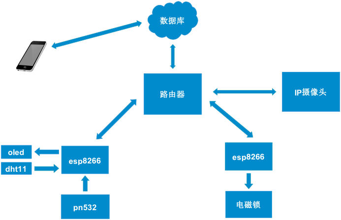
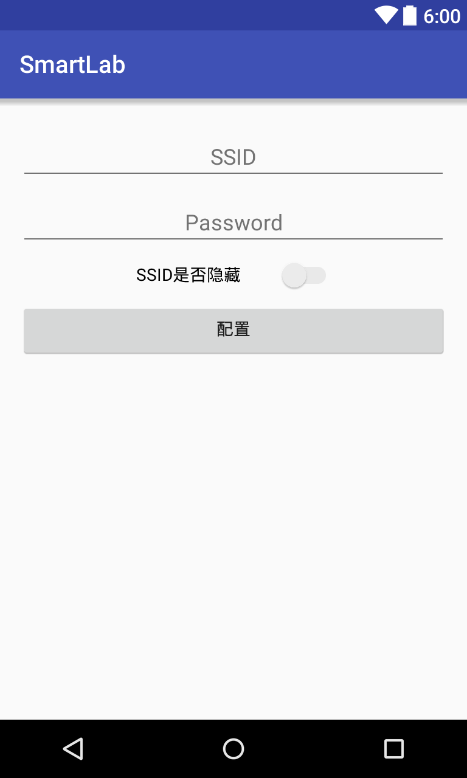
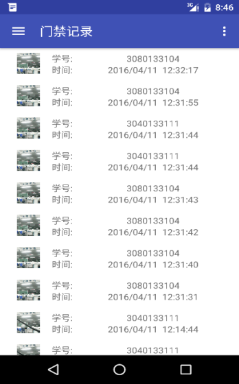

# The-Door-Access-control

门禁系统 基于ESP8266

[视频演示.mp4](http://o9xqkc534.bkt.clouddn.com/%E8%BF%9C%E7%A8%8B%E5%8F%AF%E8%A7%86%E5%8C%96%E9%97%A8%E7%A6%81%E7%B3%BB%E7%BB%9F%E7%9A%84%E8%AE%BE%E8%AE%A1%E4%B8%8E%E5%AE%9E%E7%8E%B0.mp4)

[专利号：2016203037731(点击查看详情)](http://cpquery.sipo.gov.cn/txnQueryBibliographicData.do?select-key:shenqingh=2016203037731)
> 吐槽一下专利代理公司 :triumph:妈的，把我名字写错了，正确的是[昻]  不过不知道有多少人能注意到这细节:sweat: 

视频中的小伙伴是我的搭档，负责硬件电路搭建，为了搭电路没少熬夜，挺感谢他的。

这是本人的毕业设计（专科）历时一个月完成。在做毕业设计之前一直在准备转本考试，考完试，距离毕业答辩只剩一个半月，时间非常紧。从零开始，读乐鑫的sdk手册，到完成功能，用了一个月多点，一个人同时开发ESP8266，Android，还有OpenWrt上的Python程序，工作量大，时间紧，导致代码质量不好，但庆幸的是功能都完成了，公开答辩演示也没什么问题。通过这次毕业设计，学到了好多知识。

> 本系统包括传感器单元，RFID射频读卡单元，IP摄像头，中心控制单元，次级控制单元，云端服务器，路由器单元，显示单元，执行单元，手机APP端；中心控制单元采用esp8266并与传感器单元、RFID读卡单元、显示单元共用电源；中心控制单元输入端与RFID读卡单元、传感器单元相连，中心控制单元输出端与显示单元，次级控制单元与执行单元相连；中心控制单元处理传感器单元所传数据，分析处理后送往显示单元显示；中心控制单元获得RFID读卡单元所传数据，通过WiFi功能无线传输到路由器单元，由路由器单元接入广域网，数据上传至云端服务器数据库。存储分析对比，云端服务器返回指令传输至路由器单元，最终通过无线局域网返回至次级控制单元，次级控制单元控制执行单元工作。中心控制单元接收RFID读卡模块数据，分析数据，通过WiFi发送拍照指令至路由器单元，路由器单元转发到IP摄像头，IP摄像头拍照，图像数据由路由器转发至云端服务器存储；手机客户端可通过广域网进入服务器查询所存储数据，包括图片。利用自带ＮＦＣ技术读取射频卡，获得射频卡ＩＤ，客户端设置权限，管理员可进入服务器修改数据库注册用户，或者注销用户（管理员可通过手机进行用户的新增、查询、删除，及权限修改）。             ——摘自我的毕业论文

#### 论文嘛，就得以写得高（kan）大（bu）上（dong）为目的！

## TODO
- [x] ESP8266程序
- [x] Android程序
- [ ] OpenWrt上的python程序
- [ ] 硬件原理图
- [ ] ~~论文~~

## 系统拓扑图

## 实物图

## 软件截图

### SmartConfig界面

### 登记用户界面

### 门禁记录界面

